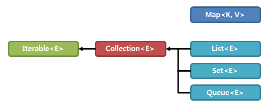
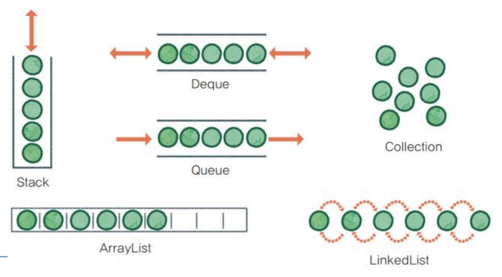
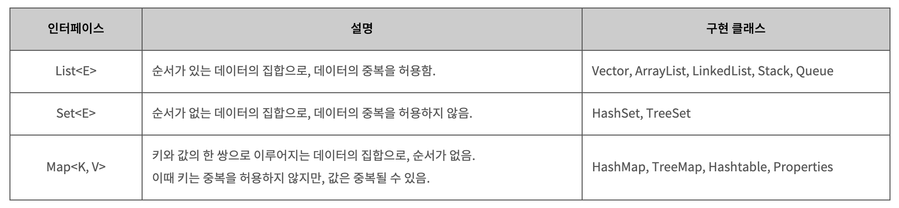
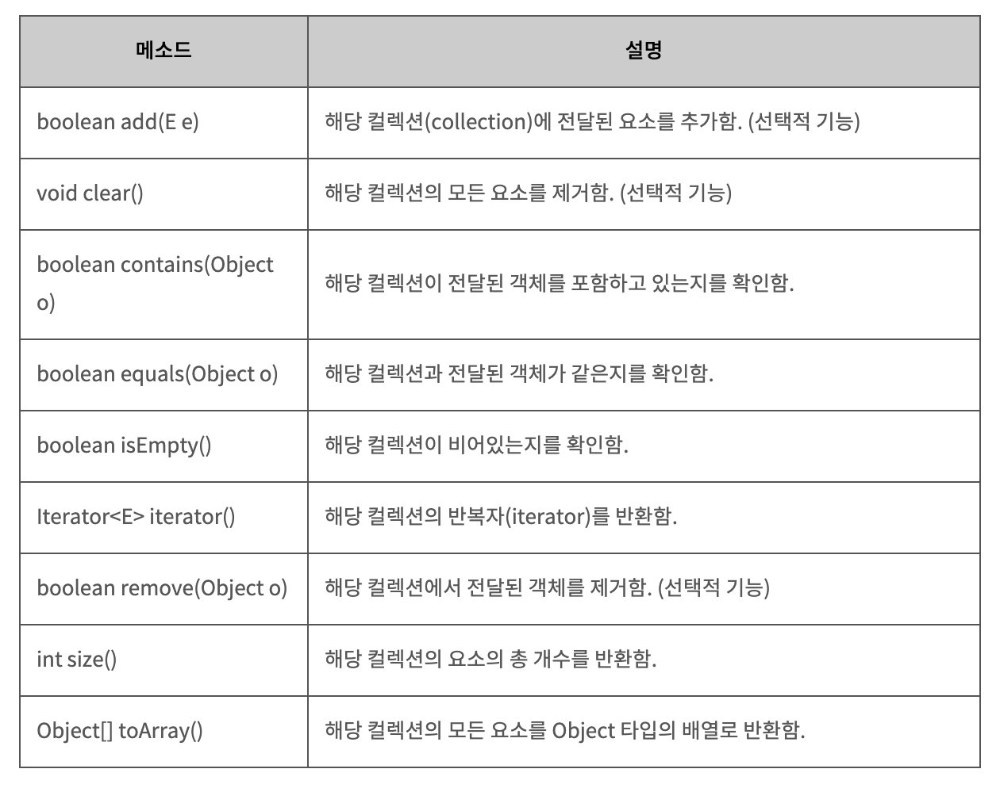
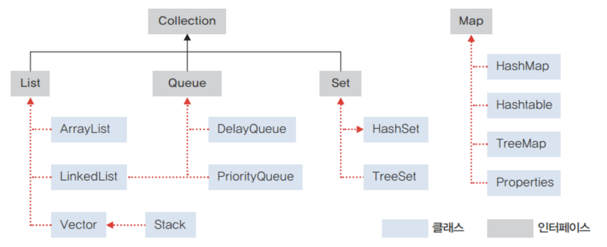

# [Java] Java Collection Framework (JCF)

# 0. **Collection?**

**사전적 의미 : 요소를 수집해서 저장하는 것.**

**즉, 데이터를 저장하는 자료구조와 데이터를 처리하는 알고리즘을 구조화하여 클래스로 구현해놓은 것.**

- **자바에서의 자료구조 유형은 다음과 같다.**순서가 있는 목록인 **List형**
- 순서가 중요하지 않은 목록인 **Set형**
- 먼저 들어온 것이 먼저 나가는 **Queue형**KEY-VALUE의 형태로 저장되는 **Map형**

자바 컬렉션은 객체를 수집해서 저장하는 역할을 한다.

자바 컬렉션 프레임워크는 몇 가지 인터페이스를 통해 다양한 컬렉션을 이용할 수 있도록 한다.

자바에서 컬렉션 프레임워크를 구성하고 있는 인터페이스 간의 상속 관계는 다음 그림과 같다.



## 1. Java Collection Framework

자바에서 다수의 데이터를 쉽고 효과적으로 처리할 수 있는 표준화된 방법을 제공하는 클래스의 집합을 의미한다. 즉, 데이터를 저장하는 자료 구조와 데이터를 처리하는 알고리즘을 구조화하여 클래스로 구현해 놓은 것을 말한다.



배열을 사용하다보면 여러가지 문제가 발생한다. **크기를 정적으로 할당해 사용해야해서 그 크기를 초과하게되면 더 이상 데이터를 저장할 수 없다.** 또 데이터를 삭제하면 해당 인덱스의 데이터가 비어있어 ,된다.

이런 배열의 문제점을 해결하기 위해 자바에서는 자료구조를 바탕으로 객체나 데이터들을 효율적으로 관리(추가, 삭제, 검색, 저장) 할 수 있는 자료구조들을 만들어 놓았다. 이러한 자료구조들이 있는 라이브러리를 **컬렉션 프레임워크(JCF)**라고 한다.

자바에서 제공하는 Collection은 크게 `List`, `Queue`, `Set` 3가지 인터페이스로 나뉘어져있다. 그리고 각 인터페이스별로 그것들을 **구현**한 클래스들이 있다.

아래 그림은 컬렉션 프레임워크의 상속관계를 나타낸다. (점선은 구현 관계이고 실선은 확장 관계이다.)

자바에서 컬렉션 프레임워크를 구성하고 있는 인터페이스 간의 상속 관계는 다음 그림과 같다.

Collection을 구현한 클래스 및 인터페이스들은 `java.util` 패키지에 들어있다. 이런 구현된 클래스들이 위 그림에서 녹색으로 표시된 박스들이다.

## 2. 주요 인터페이스의 간략한 특징

자바에서 컬렉션 프레임워크를 구성하고 있는 주요 인터페이스의 간략한 특징은 다음과 같다.



Vector나 Hashtable과 같은 컬렉션 클래스는 예전부터 사용해 왔으므로, 기존 코드와의 호환을 위해 아직도 남아 있다. (쓰지 말자)

그러나 새롭게 추가된 ArrayList나 HashMap 클래스를 사용하는 것이 성능 면에서도 더 좋다. 

아래 예시는 ArrayList 클래스를 이용하여 리스트를 생성하였다. 

```java
import java.util.*;

 

public class Collection01 {

    public static void main(String[] args) {

        // 리스트 생성

        ArrayList<String> arrList = new ArrayList<String>();

 

        // 리스트에 요소의 저장

        arrList.add("넷");

        arrList.add("둘");

        arrList.add("셋");

        arrList.add("하나");

 

        // 리스트 요소의 출력

        for(int i = 0; i < arrList.size(); i++) {

            System.out.println(arrList.get(i));

        }

    }

}
```

## 3. Collection 인터페이스

collection framework에서 List와 Set의 공통점을 모아 재정의한 인터페이스이며, 두 인터페이스는 그것을 상속받는다. 

따라서 collection interface는 컬랙션 클래스에 저장된 데이터를 읽고, 추가하고, 삭제하는 등 기본적인 메서드를 제공한다. 



 

