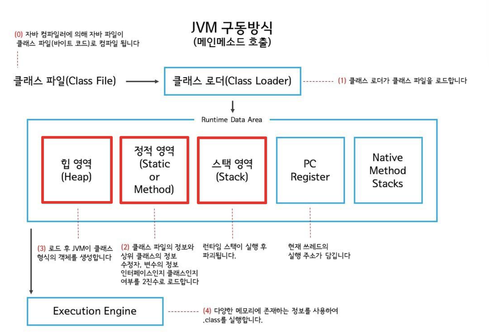
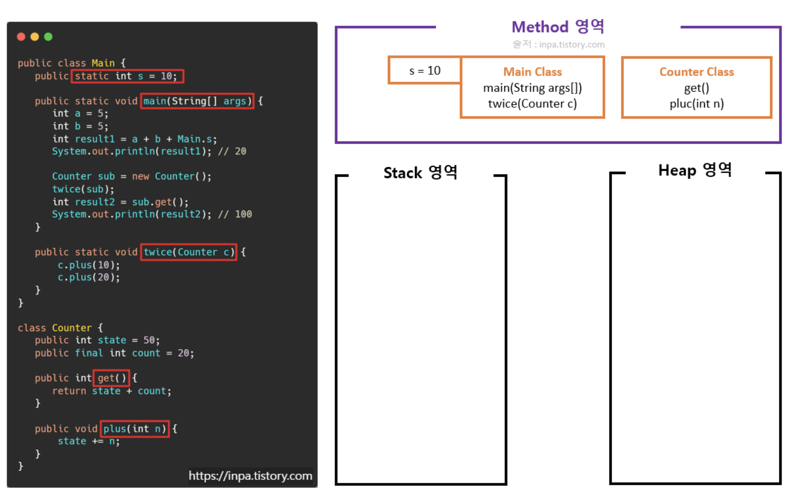
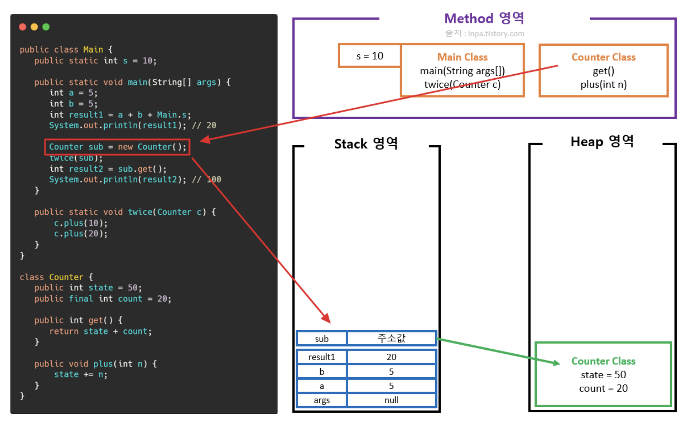

# [Java]메모리 영역

## 0.  메모리 영역

모든 자바 프로그램은 자바 가상 머신(JVM)을 통해서 실행된다.

자바 프로그램이 실행되면, JVM은 OS로부터 메모리를 할당받고, 그 메모리를 용도에 따라서 여러 영역으로 나누어 관리 한다.

JVM의 메모리공간(Runtime Data Area)은 크게 **Method(Static) 영역, Stack 영역, Heap 영역**으로 구분되고 데이터 타입(자료형)에 따라 각 영역에 나눠서 할당 되게 된다.



---

### 메소드(static) 영역

- JVM이 동작해서 **클래스가 로딩될 때 생성.**
- JVM이 읽어들인 클래스와 인터페이스 대한 **런타임 상수 풀, 멤버 변수(필드), 클래스 변수(Static 변수), 상수(final), 생성자(constructor)와 메소드(method)** 등을 저장하는 공간.
- Method(Static) 영역에 있는 것은 **어느곳에서나 접근 가능**
- **Method(Static) 영역의 데이터는 프로그램의 시작부터 종료가 될 때까지 메모리에 남아있다.**
그래서 static 메모리에 있는 데이터들은 프로그램이 종료될 때까지 어디서든 사용이 가능하다.
그러나 static 데이터를 무분별하게 많이 사용할 경우 메모리 부족 현상이 일어날수 있게 된다.

```java
public class Main {
   public static int s = 10;

   public static void main(String[] args) {
      int a = 5;
      int b = 5;
      int result1 = a + b + Main.s;
      System.out.println(result1); // 20

      Counter sub = new Counter();
      twice(sub);
      int result2 = sub.get();
      System.out.println(result2); // 100
   }

   public static void twice(Counter c) {
       c.plus(10);
       c.plus(20);
   }
}

class Counter {
   public int state = 50;
   public final int count = 20;

   public int get() {
      return state + count;
   }

   public void plus(int n) {
       state += n;
   }
}
```



1. 클래스 변수(static)와 메소드는 무조건 Method 영역에 적재
2. 일반 인스턴스 변수인 Counter 클래스의 변수state 그리고count 은 final 키워드가 붙었음에도 Method 영역에 들어가지 않음 (Heap 에 들어감)

---

### 스택(stack) 영역

- 메소드 내에서 정의하는 **기본 자료형에 해당되는 지역변수의 데이터 값**이 저장되는 공간
- 메소드가 호출될때 스택 영역에 **스택 프레임**이 생기고 그안에 메소드를 호출
- **primitive 타입의 데이터(int, double, byte, long, boolean 등) 에 해당되는 지역변수, 매개 변수** 데이터 값이 저장메소드가 호출 될 때 메모리에 할당되고 종료되면 메모리에서 사라짐
- Stack 은 후입선출 *LIFO(Last-In-First-Out)* 의 특성을 가지며, **스코프(Scope) 의 범위를 벗어나면 스택 메모리에서 사라진다.**

💡 **stack frame?**

하나의 메서드에 필요한 메모리 덩어리를 묶어서 스택 프레임(Stack Frame)이라고 한다.

**하나의 메서드당 하나의 스택 프레임**이 필요하며, **메서드를 호출하기 직전 스택프레임을 자바 Stack에 생성한 후 메서드를 호출하**게 된다.

스택 프레임에 쌓이는 데이터는 **메서드의 매개변수, 지역변수, 리턴값** 등이 있다.

만일 **메서드 호출 범위가 종료되면 스택에서 제거**된다.


처음의 샘플코드에서 public static void main(String[] agrs) 라는 메인 메서드가 실행되면 스택 영역에 스택 프레임이 쌓이고 안에 지역변수와 매개변수가 담기게 된다.

메소드의 매개변수 args 와 메소드 블록 안의 지역변수a ,b ,result1 이 담아진다.


메소드의 매개변수args 와 메소드 블록 안의 지역변수a ,b ,result1 이 담아진다.

---

### 힙(heap) 영역

- JVM이 관리하는 프로그램 상에서 데이터를 저장하기 위해 **런타임 시 동적으로 할당**하여 사용하는 영역
- **참조형(Reference Type) 데이터 타입을 갖는 객체(인스턴스), 배열** 등이 저장 되는 공간
- 단, Heap 영역에 있는 오브젝트들을 가리키는 레퍼런스 변수는 stack에 적재
- Heap 영역은 Stack 영역과 다르게 보관되는 **메모리가 호출이 끝나더라도 삭제되지 않고 유지된다.**
그러다 어떤 참조 변수도 Heap 영역에 있는 인스턴스를 참조하지 않게 된다면, **GC(가비지 컬렉터)**에 의해 메모리에서 청소된다.
- stack은 스레드 갯수마다 각각 생성되지만, heap은 몇개의 스레드가 존재하든 상관없이 **단 하나의 heap 영역만 존재**

1. 생성자 new Counter() 를 호출한다.



생성자를 호출하면 heap 영역에 Counter 클래스 인스턴스 변수들이 저장되게 되고, stack 영역의 지역변수 sub 에 주소값으로 연결되게 된다.

2.  twice(sub) 메소드를 실행한다.


새로운 메소드를 실행하는 것이니, stack 영역에 새로운 스택 프레임이 생기게 된다.그리고 아규먼트로 클래스를 전달하였기 때문에 twice() 의 매개변수 c 는 주소값으로 같은 힙 영역을 가리키게 된다.

3. 객체의 plus() 메소드를 실행한다.


- 객체 Counter에 정의된plus() 메소드를 호출하게 되는데, 이 역시 메소드 이므로 스택 영역에 새로운 스택 프레임으로 생성되게 된다.
- 다만 여기서this 라는 암묵적인 변수가 자동 생성되게 되는데, 이this 변수는 자동으로 힙 영역에 있는 Counter 객체를 가리키게 된다.
- 따라서plus() 메소드 안의 코드 state += n 이 동작하면서 힙 영역에 있는 인스턴스 변수 state가 값이 변하게 된다.

4. 객체의state 인스턴스 변수를 가져오는get() 메소드를 호출한다.


- 모두 실행되어 볼일이 끝난 plus() 스택 프레임은 제거 된다.
- 마찬가지로sub 객체변수의 메소드get()을 호출하면 스택 영역에 새로운 스택 프레임이 생기고,this 변수가 힙 영역의 객체를 가리키게 된다. 그리고 힙 영역의 변수를 반환하게 된다.
- 마지막으로 할일을 마친get() 스택 프레임은 스택 영역에서 제거되고, main 스택 프레임에result2 지역 변수가 추가된다.

> 💡Tip  : 이 예제에서 강조되는 부분은 호출되는 메서드가 파라미터로 객체값을 전달받아 객체의 상태를 변경하게 되면, 메서드 종료(스택 제거) 이후에도 힙 영역에 있는 객체의 상태는 쭉 유지된다는 점이다.
> 

5. 마지막 코드가 실행되면 main 스택 프레임은 스택 영역에서 제거된다.


스택 영역은 메서드의 끝을 알리는 닫는 중괄호} 를 만나면 자동으로 메모리에서 제거된다.그러나 힙 영역에는 여전히 객체 데이터가 메모리에 상주되게 된다.

6. 가비지 컬렉터(GC)가 힙 영역을 청소한다.


- 가비지 컬렉터는 힙 영역에 참조되지 않고 남아버린 고아 객체들을 식별해 힙 영역을 청소 해주는 역할을 한다.
- 추가로 코드 실행이 모두 끝나면 Method(Static) 영역도 비워지게 된다.

## 2. Heap vs Stack

- 힙 메모리는 애플리케이션의 모든 부분에서 사용되며, 반면에 스택 메모리는 하나의 스레드가 실행될 때 사용.
그래서 힙 과 메서드 공간에 저장된 객체는 어디서든지 접근이 가능하지만, 스택 메모리는 다른 스레드가 접근할 수 없다.
- 언제든지 객체가 생성되면 항상 힙 공간에 저장되며, 스택 메모리는 힙 공간에 있는 객체를 참조만 한다.
즉, 스택 메모리는 primitive 타입의 지역변수와 힙 공간에 있는 객체 참조 변수만 갖고 있다.
- 스택메모리의 생명주기는 매우 짧으며, 힙 메모리는 애플리케이션의 시작부터 끝까지 살아남는다.
- 자바 코드를 실행할때 따로-Xms과-Xmx 옵션을 사용하면 힙 메모리의 초기 사이즈와 최대 사이즈를 조절할 수 있다.
- 스택 메모리가 가득차면 자바에서는 java.lang.StackOverFlowError를 발생.
힙 메모리가 가득차면 java.lang.OutOfMemoryError : Java Heap Space 에러를 발생
- 스택 메모리 사이즈는 힙 메모리와 비교했을 때 매우 적다. 하지만 스택 메모리는 간단한 메모리 할당 방법(LIFO)를 사용하므로 힙 메모리보다 빠르다.


출처:

[https://inpa.tistory.com/entry/JAVA-☕-그림으로-보는-자바-코드의-메모리-영역스택-힙](https://inpa.tistory.com/entry/JAVA-%E2%98%95-%EA%B7%B8%EB%A6%BC%EC%9C%BC%EB%A1%9C-%EB%B3%B4%EB%8A%94-%EC%9E%90%EB%B0%94-%EC%BD%94%EB%93%9C%EC%9D%98-%EB%A9%94%EB%AA%A8%EB%A6%AC-%EC%98%81%EC%97%AD%EC%8A%A4%ED%83%9D-%ED%9E%99)

[Inpa Dev 👨‍💻:티스토리]